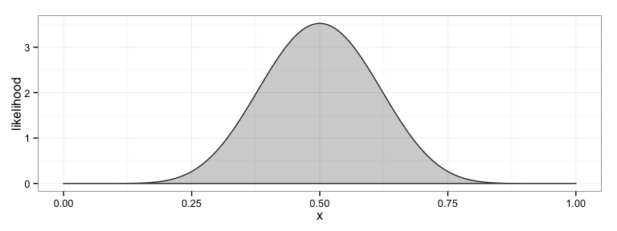

<!-- README.md is generated from README.Rmd. Please edit that file -->
bayesRates
==========

**bayesRates** is an R package that allows users to (1) perform two-sample rate tests from a Bayesian perspective, (2) view decision rules to understand them better, and (3) determine sample sizes for designing such procedures. The package currently works for binomial and Poisson data.

``` r
library(bayesRates)
#> Loading required package: ggplot2
```

Binomial tests
--------------

Suppose that we have two coins, a quarter and a half dollar, and we're interested in determining whether or not they flip heads with the same probability. After flipping each 50 times, the quarter flips heads 26 times and the half dollar flips heads 34 times. Should we conclude the likelihoods are the same?

One way to address the problem is with `prop.test()`:

``` r
prop.test(x = c(26, 34), n = c(50, 50), correct = FALSE)
#> 
#>  2-sample test for equality of proportions without continuity
#>  correction
#> 
#> data:  c(26, 34) out of c(50, 50)
#> X-squared = 2.6667, df = 1, p-value = 0.1025
#> alternative hypothesis: two.sided
#> 95 percent confidence interval:
#>  -0.34945868  0.02945868
#> sample estimates:
#> prop 1 prop 2 
#>   0.52   0.68
```

`prop.test()` uses the standard asymptotic two-sample test of proportions based on the central limit theorem using pooling:

``` r
x <- 26; nx <- 50; px <- x/nx
y <- 34; ny <- 50; py <- y/ny
pp <- (x+y)/(nx+ny)

t <- (px-py)/sqrt(pp*(1-pp)/nx + pp*(1-pp)/ny)
2*pnorm(t) # two-sided p-value using the clt
#> [1] 0.1024704
```

Note that this procedure would not reject at the 10% level.

`binom.test()` is similar, but uses the exact different procedure. **bayesRates** offers another test of the same hypothesis with more of a Bayesian flavor, `bayesBinomTest()`. In this function, the user begins by specifying probabilites ([beliefs](http://en.wikipedia.org/wiki/Bayesian_probability#Objective_and_subjective_Bayesian_probabilities)) on the null and alternative hypotheses, typically `1/2` and `1/2` from the [principle of insufficient reason](http://en.wikipedia.org/wiki/Principle_of_indifference#History_of_the_principle_of_indifference). This is the default of `bayesBinomTest()`, but can be changed with the `pi0` and `pi1` arguments.

The user then specifies probability distributions on the parameters under each of the hypotheses. Under the null hypothesis, the proportions are the same quantity, and so only a single (univariate) distribution need be specified. Since [beta distributions](http://en.wikipedia.org/wiki/Beta_distribution) are well suited to this task, they are assumed in **bayesRates**, so the user only needs to specify the parameters of the beta distribution. This is facilitated with the `plotBeta()` function, which takes in the two parameters and simply plots the ensuing beta distribution. Assuming the two coins flip heads at the same rate, it is reasonable to assume that that rate is around 50%, so that a Beta(10, 10) might be reasonable:

``` r
plotBeta(10, 10)
```



Now operate under the assumption that they are different. In that case, what are the beliefs about the two? One way to think about this is to think about them one at a time. If we think that they are the same, and that the quarter is fair (represented by the Beta(10,10)), then we can assume they are both like that. If we think they are different, we may still think that the quarter is fair (Beta(10,10)), so we only need to choose the distribution of the half-dollar. Perhaps that distribution is well-represented by a Beta(2,1) distribution. The two distributions can be visualized together using `plotBeta()`:

``` r
plotBeta(c(10,2),c(10,1))
```


At this point, we're ready for `bayesBinomTest()`:

``` r
bayesBinomTest(x = c(26, 34), n = 50,  
  a1 = 10, b1 = 10,
  a2 =  2, b2 = 1
)
#> 
#>  2-sample test for equality of proportions with prior information
#> 
#> data:  c(26, 34) out of c(50, 50)
#> Bayes factor = 0.6643
#> Hypotheses priors:
#> P(H0) P(H1) 
#>   0.5   0.5 
#> Prior odds:
#> [1] 1
#> Prior hyper-parameters:
#>       alpha beta
#> null     10   10
#> alt 1    10   10
#> alt 2     2    1
#> Sample estimates:
#>    prop 1    prop 2 
#> 0.5142857 0.6792453 
#> Posterior odds:
#> [1] 0.6642844
#> Bayes rule critical value = 1
#> Conclusion : Reject null hypothesis of proportion equivalence
```

Note that the conclusion is to reject \(H_{0}\). The conclusion makes use of the optimal decision rule assuming that [Type I and Type II errors](http://en.wikipedia.org/wiki/Type_I_and_type_II_errors) are equally bad; this result can be found in [Zhao et al. (2011)](http://link.springer.com/article/10.1007/s11424-011-8250-x#page-1) are equally unfavorable.

### Visualizing the decision rule

`bayesBinomTest()` assumes that

-   the loss associated with Type I and Type II errors are the same (this can be changed with the `c1` and `c2`, or simply the `c`, arguments),

-   the prior probabilities of the null and alternative hypotheses is the same (the prior odds is 1; this can be changed with arguments `pi0` and `pi1`), and

-   the decision rule is the optimal one (see [Zhao et al. 2011](http://link.springer.com/article/10.1007/s11424-011-8250-x#page-1)). Under these assumptions, once the hyperparameters `a1`, `b1`, `a2`, and `b2` are set, the decision rule itself is entirely characterized. (If the user should want the hyperparameters on the null hypothesis and the first probability of the alternative, he can specify them with `a` and `b` in addition to the arguments above).

Apart from seeing the decision rule's action on one dataset (that's what `bayesBinomTest()` does), we can visualize the entire decision rule using the `plotBinomRule()` function:

``` r
plotBinomRule(n = 50, 
  a1 = 10, b1 = 10,
  a2 = 2, b2 = 1
)
```


Note that this rule rejects the null hypothesis.

In this graphic, the green squares indicate places where the test concludes that the two have the same probability of heads (H0); where it is red, it concludes that the two have different probabilities of flipping heads. Notice that the rule is not symmetric. This is due to the prior on the alternative hypothesis favoring the half dollar flipping heads more often.

### Sample size determination

Suppose now that we want to know how many times we need to flip the coins until the resulting decision rule will reject on average 80% of the time when the null hypothesis is false.

A brief time-out should be taken to explain precisely what we mean in this context. In general, the sample size determination problem seeks to find a requisite sample size for a particular decision rule to meet a specified level of [power](http://en.wikipedia.org/wiki/Statistical_power); that is, the probability that the test rejects when it should (the conclusion is in favor of H1 when H1 is in fact true). However, there are several ways that the null hypothesis can be false (and true, in fact), so power is not simply a number, but a function defined over the alternative space. A simple example suffices to see this idea: suppose that the quarter flips heads 50% of the time and the half dollar flips heads 52% of the time. Since 50% ≠ 52%, H0 is false and H1 is true; however, the difference is so small, that it is unlikely that a test will reveal the difference. We would say (loosely) that the power is very low. On the other hand, if the half dollar flips heads 82% of the time, we would expect the power to be quite high. Thus, the concept of power depends on the probabilities themselves.

In this context we use a related topic called expected Bayesian power (EBP), but we'll often simply refer to it as power. The difference is that while power depends on the probabilities themselves, the EBP combines all of the possible powers and [averages them, weighting by their likelihood of occurrence](http://en.wikipedia.org/wiki/Expected_value) under the prior distribution specified by the alternative hypothesis : the product of the Beta(10,10) and the Beta(2,1) in our example.

The `findSize()` function takes in a power (EBP) specification, priors parameters on the null and alternative hypotheses and determines the sample size needed so that the decision rule made by `bayesBinomTest()` has *at least* that power (EBP).

``` r
findSize(.80, 
  a1 = 10, b1 = 10,
  a2 = 2, b2 = 1,
  family = "binomial"
)
#> size = 2, power = 0.5
#> size = 4, power = 0.5342
#> size = 8, power = 0.5548
#> size = 16, power = 0.594
#> size = 32, power = 0.6562
#> size = 64, power = 0.7169
#> size = 128, power = 0.7734
#> size = 256, power = 0.8225
#> size = 255, power = 0.8224
#> size = 254, power = 0.8223
#> size = 253, power = 0.8225
#> size = 252, power = 0.8221
#> size = 251, power = 0.8218
#> size = 250, power = 0.8214
#> size = 249, power = 0.821
#> size = 248, power = 0.8207
#> size = 247, power = 0.8204
#> size = 246, power = 0.82
#> size = 245, power = 0.8197
#> size = 244, power = 0.8194
#> size = 243, power = 0.8191
#> size = 242, power = 0.8188
#> size = 241, power = 0.8185
#> size = 240, power = 0.8182
#> size = 239, power = 0.8179
#> size = 238, power = 0.8177
#> size = 237, power = 0.8175
#> size = 236, power = 0.8173
#> size = 235, power = 0.8172
#> size = 234, power = 0.817
#> size = 233, power = 0.8166
#> size = 232, power = 0.8162
#> size = 231, power = 0.8159
#> size = 230, power = 0.8156
#> size = 229, power = 0.8152
#> size = 228, power = 0.8148
#> size = 227, power = 0.8144
#> size = 226, power = 0.8141
#> size = 225, power = 0.8138
#> size = 224, power = 0.8135
#> size = 223, power = 0.8132
#> size = 222, power = 0.8129
#> size = 221, power = 0.8126
#> size = 220, power = 0.8123
#> size = 219, power = 0.812
#> size = 218, power = 0.8118
#> size = 217, power = 0.8117
#> size = 216, power = 0.8116
#> size = 215, power = 0.8112
#> size = 214, power = 0.8108
#> size = 213, power = 0.8104
#> size = 212, power = 0.8101
#> size = 211, power = 0.8096
#> size = 210, power = 0.8093
#> size = 209, power = 0.8089
#> size = 208, power = 0.8085
#> size = 207, power = 0.8082
#> size = 206, power = 0.8079
#> size = 205, power = 0.8075
#> size = 204, power = 0.8072
#> size = 203, power = 0.8069
#> size = 202, power = 0.8066
#> size = 201, power = 0.8064
#> size = 200, power = 0.8061
#> size = 199, power = 0.806
#> size = 198, power = 0.8056
#> size = 197, power = 0.8051
#> size = 196, power = 0.8047
#> size = 195, power = 0.8043
#> size = 194, power = 0.8038
#> size = 193, power = 0.8034
#> size = 192, power = 0.803
#> size = 191, power = 0.8026
#> size = 190, power = 0.8023
#> size = 189, power = 0.8018
#> size = 188, power = 0.8014
#> size = 187, power = 0.8011
#> size = 186, power = 0.8007
#> size = 185, power = 0.8004
#> size = 184, power = 0.8
#> size = 183, power = 0.7997
#> $size
#> [1] 184
#> 
#> $power
#> [1] 0.8000492
```

This output is *long*! Why? What is going on here? Given the prior specifications, one can write down a formula for the

Installation
------------

-   From Github: `devtools::install_github("dkahle/bayesRates")`

<!-- * From CRAN: `install.packages("bayesRates")` -->
