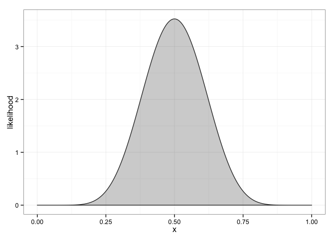
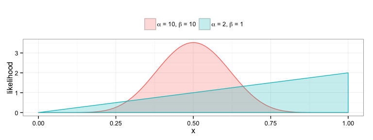

<!-- README.md is generated from README.Rmd. Please edit that file -->
bayesRates
==========

**bayesRates** is an R package that allows users to (1) perform two-sample tests with binomial and Poisson data from a Bayesian perspective and (2) determine sample sizes for designing such procedures.

``` r
library(bayesRates)
#> Loading required package: ggplot2
```

Binomial tests
==============

Suppose that we have two coins, a quarter and a half dollar, and we're interested in determining whether or not they flip heads with the same probability. After flipping each 50 times, the quarter flips heads 26 times and the half dollar flips heads 34 times. Should we conclude the likelihoods are the same?

One way to address the problem is with `prop.test()`:

``` r
prop.test(x = c(26, 34), n = c(50, 50), correct = FALSE)
#> 
#>  2-sample test for equality of proportions without continuity
#>  correction
#> 
#> data:  c(26, 34) out of c(50, 50)
#> X-squared = 2.6667, df = 1, p-value = 0.1025
#> alternative hypothesis: two.sided
#> 95 percent confidence interval:
#>  -0.34945868  0.02945868
#> sample estimates:
#> prop 1 prop 2 
#>   0.52   0.68
```

`prop.test()` uses the standard asymptotic two-sample test of proportions based on the central limit theorem using pooling:

``` r
x <- 26; nx <- 50; px <- x/nx
y <- 34; ny <- 50; py <- y/ny
pp <- (x+y)/(nx+ny)

t <- (px-py)/sqrt(pp*(1-pp)/nx + pp*(1-pp)/ny)
2*pnorm(t) # two-sided p-value using the clt
#> [1] 0.1024704
```

Note that this procedure would not reject at the 10% level.

`binom.test()` is similar, but uses the exact different procedure. **bayesRates** offers another test of the same hypothesis with more of a Bayesian flavor, `bayesBinomTest()`. In this function, the user begins by specifying probabilites ([beliefs](http://en.wikipedia.org/wiki/Bayesian_probability#Objective_and_subjective_Bayesian_probabilities)) on the null and alternative hypotheses, typically `1/2` and `1/2` from the [principle of insufficient reason](http://en.wikipedia.org/wiki/Principle_of_indifference#History_of_the_principle_of_indifference).

``` r
pH0 <- 1/2; pH1 <- 1/2
```

The user then specifies probability distributions on the parameters under each of the hypotheses. Under the null hypothesis, the proportions are the same quantity, and so only a single (univariate) distribution need be specified. Since [beta distributions](http://en.wikipedia.org/wiki/Beta_distribution) are well suited to this task, they are assumed in **bayesRates**, so the user only needs to specify the parameters of the beta distribution. This is facilitated with the `plotBeta()` function, which takes in the two parameters and simply plots the ensuing beta distribution. Assuming the two coins flip heads at the same rate, it is reasonable to assume that that rate is around 50%, so that a Beta(10, 10) might be reasonable:

``` r
plotBeta(10, 10)
```



Now operate under the assumption that they are different. In that case, what are the beliefs about the two? One way to think about this is to think about them one at a time. If we think that they are the same, and that the quarter is fair (represented by the Beta(10,10)), then we can assume they are both like that. If we think they are different, we may still think that the quarter is fair (Beta(10,10)), so we only need to choose the distribution of the half-dollar. Perhaps that distribution is well-represented by a Beta(2,1) distribution. The two distributions can be visualized together using `plotBeta()`:

``` r
plotBeta(c(10,2),c(10,1))
```



At this point, we're ready for `bayesBinomTest()`:

``` r
bayesBinomTest(x = c(26, 34), n = 50,  
  a1 = 10, b1 = 10,
  a2 =  2, b2 = 1
)
#> 
#>  2-sample test for equality of proportions with prior information
#> 
#> data:  c(26, 34) out of c(50, 50)
#> Bayes factor = 0.6643
#> Hypotheses priors:
#> P(H0) P(H1) 
#>   0.5   0.5 
#> Prior odds:
#> [1] 1
#> Prior hyper-parameters:
#>       alpha beta
#> null     10   10
#> alt 1    10   10
#> alt 2     2    1
#> Sample estimates:
#>    prop 1    prop 2 
#> 0.5142857 0.6792453 
#> Posterior odds:
#> [1] 0.6642844
#> Bayes rule critical value = 1
#> Conclusion : Reject null hypothesis of proportion equivalence
```

Installation
------------

-   From Github: `devtools::install_github("dkahle/bayesRates")`

<!-- * From CRAN: `install.packages("bayesRates")` -->
