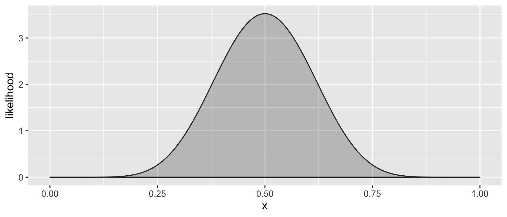
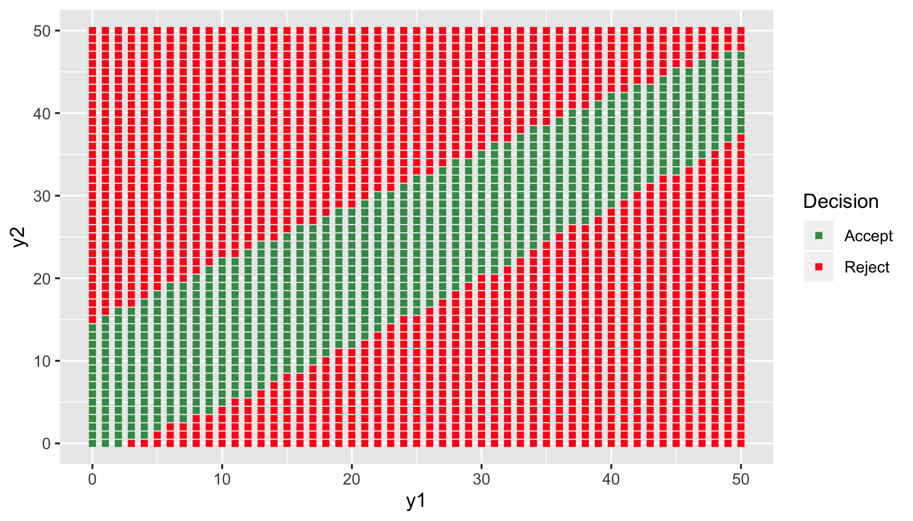

<!-- README.md is generated from README.Rmd. Please edit that file -->

bayesRates
==========

<!-- badges: start -->

[](https://cran.r-project.org/package=bayesRates)
<!-- badges: end -->

**bayesRates** is an R package that allows users to (1) perform
two-sample rate tests from a Bayesian perspective, (2) view decision
rules to understand them better, and (3) determine sample sizes for
designing such procedures. The package currently works for binomial and
Poisson data.

``` r
library("bayesRates")
# Loading required package: ggplot2
```

Binomial tests
--------------

Suppose that we have two coins, a quarter and a half dollar, and we’re
interested in determining whether or not they flip heads with the same
probability. After flipping each 50 times, the quarter flips heads 26
times and the half dollar flips heads 34 times. Should we conclude the
likelihoods are the same?

One way to address the problem is with `prop.test()`:

``` r
prop.test(x = c(26, 34), n = c(50, 50), correct = FALSE)
# 
#   2-sample test for equality of proportions without continuity
#   correction
# 
# data:  c(26, 34) out of c(50, 50)
# X-squared = 2.6667, df = 1, p-value = 0.1025
# alternative hypothesis: two.sided
# 95 percent confidence interval:
#  -0.34945868  0.02945868
# sample estimates:
# prop 1 prop 2 
#   0.52   0.68
```

`prop.test()` uses the standard asymptotic two-sample test of
proportions based on the central limit theorem using pooling:

``` r
x <- 26; nx <- 50; px <- x/nx
y <- 34; ny <- 50; py <- y/ny
pp <- (x+y)/(nx+ny)

t <- (px-py)/sqrt(pp*(1-pp)/nx + pp*(1-pp)/ny)
2*pnorm(t) # two-sided p-value using the clt
# [1] 0.1024704
```

Note that this procedure would not reject at the 10% level.

`binom.test()` is similar, but uses the exact different procedure.
**bayesRates** offers another test of the same hypothesis with more of a
Bayesian flavor, `bayesBinomTest()`. In this function, the user begins
by specifying probabilites
([beliefs](http://en.wikipedia.org/wiki/Bayesian_probability#Objective_and_subjective_Bayesian_probabilities))
on the null and alternative hypotheses, typically `1/2` and `1/2` from
the [principle of insufficient
reason](http://en.wikipedia.org/wiki/Principle_of_indifference#History_of_the_principle_of_indifference).
This is the default of `bayesBinomTest()`, but can be changed with the
`pi0` and `pi1` arguments.

The user then specifies probability distributions on the parameters
under each of the hypotheses. Under the null hypothesis, the proportions
are the same quantity, and so only a single (univariate) distribution
need be specified. Since [beta
distributions](http://en.wikipedia.org/wiki/Beta_distribution) are well
suited to this task, they are assumed in **bayesRates**, so the user
only needs to specify the parameters of the beta distribution. This is
facilitated with the `plotBeta()` function, which takes in the two
parameters and simply plots the ensuing beta distribution. Assuming the
two coins flip heads at the same rate, it is reasonable to assume that
that rate is around 50%, so that a Beta(10, 10) might be reasonable:

``` r
plotBeta(10, 10)
```



Now operate under the assumption that they are different. In that case,
what are the beliefs about the two? One way to think about this is to
think about them one at a time. If we think that they are the same, and
that the quarter is fair (represented by the Beta(10,10)), then we can
assume they are both like that. If we think they are different, we may
still think that the quarter is fair (Beta(10,10)), so we only need to
choose the distribution of the half-dollar. Perhaps that distribution is
well-represented by a Beta(2,1) distribution. The two distributions can
be visualized together using `plotBeta()`:

``` r
plotBeta(c(10,2),c(10,1))
```


At this point, we’re ready for `bayesBinomTest()`, **bayesRates**’
analogue to `prop.test()` or `binom.test()`:

``` r
bayesBinomTest(x = c(26, 34), n = 50, a1 = 10, b1 = 10, a2 =  2, b2 = 1)
# 
#   2-sample test for equality of proportions with prior information
# 
# data:  c(26, 34) out of c(50, 50)
# Bayes factor = 0.6643
# Hypotheses priors:
# P(H0) P(H1) 
#   0.5   0.5 
# Prior odds:
# [1] 1
# Prior hyper-parameters:
#       alpha beta
# null     10   10
# alt 1    10   10
# alt 2     2    1
# Sample estimates:
#    prop 1    prop 2 
# 0.5142857 0.6792453 
# Posterior odds:
# [1] 0.6642844
# Bayes rule critical value = 1
# Conclusion : Reject null hypothesis of proportion equivalence
```

Note that the conclusion is to reject the null hypothesis of equality of
rates. The conclusion makes use of the optimal decision rule assuming
that [Type I and Type II
errors](http://en.wikipedia.org/wiki/Type_I_and_type_II_errors) are
equally bad; this result can be found in [Zhao et
al. (2011)](http://link.springer.com/article/10.1007/s11424-011-8250-x#page-1)
are equally unfavorable.

### Visualizing the decision rule

`bayesBinomTest()` assumes that

-   the loss associated with Type I and Type II errors are the same
    (this can be changed with the `c1` and `c2`, or simply the `c`,
    arguments),

-   the prior probabilities of the null and alternative hypotheses is
    the same (the prior odds is 1; this can be changed with arguments
    `pi0` and `pi1`), and

-   the decision rule is the optimal one (see [Zhao et
    al. 2011](http://link.springer.com/article/10.1007/s11424-011-8250-x#page-1)).
    Under these assumptions, once the hyperparameters `a1`, `b1`, `a2`,
    and `b2` are set, the decision rule itself is entirely
    characterized. (If the user should want the hyperparameters on the
    null hypothesis and the first probability of the alternative, he can
    specify them with `a` and `b` in addition to the arguments above).

Apart from seeing the decision rule’s action on one dataset (that’s what
`bayesBinomTest()` does), we can visualize the entire decision rule
using the `plotBinomRule()` function:

``` r
plotBinomRule(n = 50, a1 = 10, b1 = 10, a2 = 2, b2 = 1)
```



Note that this rule rejects the null hypothesis.

In this graphic, the green squares indicate places where the test
concludes that the two have the same probability of heads (H0); where it
is red, it concludes that the two have different probabilities of
flipping heads. Notice that the rule is not symmetric. This is due to
the prior on the alternative hypothesis favoring the half dollar
flipping heads more often.

### Sample size determination

Suppose now that we want to know how many times we need to flip the
coins until the resulting decision rule will reject on average 80% of
the time when the null hypothesis is false.

A brief time-out should be taken to explain precisely what we mean in
this context. In general, the sample size determination problem seeks to
find a requisite sample size for a particular decision rule to meet a
specified level of
[power](http://en.wikipedia.org/wiki/Statistical_power); that is, the
probability that the test rejects when it should (the conclusion is in
favor of H1 when H1 is in fact true). However, there are several ways
that the null hypothesis can be false (and true, in fact), so power is
not simply a number, but a function defined over the alternative space.
A simple example suffices to see this idea: suppose that the quarter
flips heads 50% of the time and the half dollar flips heads 52% of the
time. Since 50% ≠ 52%, H0 is false and H1 is true; however, the
difference is so small, that it is unlikely that a test will reveal the
difference. We would say (loosely) that the power is very low. On the
other hand, if the half dollar flips heads 82% of the time, we would
expect the power to be quite high. Thus, the concept of power depends on
the probabilities themselves.

In this context we use a related topic called expected Bayesian power
(EBP), but we’ll often simply refer to it as power. The difference is
that while power depends on the probabilities themselves, the EBP
combines all of the possible powers and [averages them, weighting by
their likelihood of
occurrence](http://en.wikipedia.org/wiki/Expected_value) under the prior
distribution specified by the alternative hypothesis : the product of
the Beta(10,10) and the Beta(2,1) in our example.

The `findSize()` function takes in a power (EBP) specification, priors
parameters on the null and alternative hypotheses and determines the
smallest sample size needed so that the decision rule made by
`bayesBinomTest()` has *at least* that power.

``` r
findSize(.80, a1 = 10, b1 = 10, a2 = 2, b2 = 1, family = "binomial")
# $size
# [1] 184
# 
# $power
# [1] 0.8000492
```

How does this work? Given the prior specifications, one can write down a
formula to compute the power of the decision rule for a given sample
size; this is the `samplePowerBinomial()` function. This function is
very fast because it is actually written in C++ (via
[**Rcpp**](http://www.rcpp.org)). What `findSize()` does is to run
`samplePowerBinomial()` iteratively using a heuristic to find the
smallest sample size with a given power.

<!-- 
iteratively using the following heuristic: start at a sample size of 1 and determine the power, if it is less than the specified level, double the sample size, if not, return 1.  Continue this process until you get a power above that which was specified, and then march back one sample at a time until you get the smallest sample size that surpasses the threshold.  (The reason that this method is used over, say, a Newton-type method is that the objective function has unpredictable discontinuities.)  A faster method uses the specification `method = "halves"`:


```r
findSize(.80, 
  a1 = 10, b1 = 10,
  a2 = 2, b2 = 1,
  family = "binomial", method = "halves"
)
# $size
# [1] 183
# 
# $power
# [1] 0.7997452
```
-->

Poisson tests
-------------

From the users perspective, two-sample rates tests with Poisson data
work in precisely the same way; the only material difference is that the
prior distributions refer to the alpha (`a`, `a1`, or `a2`) and beta
(`b`, `b1`, or `b2`) parameters of a *gamma distribution*, not a beta
distribution.

As an example, suppose that we are considering two drugs: drug A, which
is the current industry standard, and drug B, a novel therapy of
interest.

Installation
------------

-   From Github:

``` r
if (!requireNamespace("devtools")) install.packages("devtools")
devtools::install_github("dkahle/bayesRates")
```

<!-- * From CRAN: `install.packages("bayesRates")` -->
